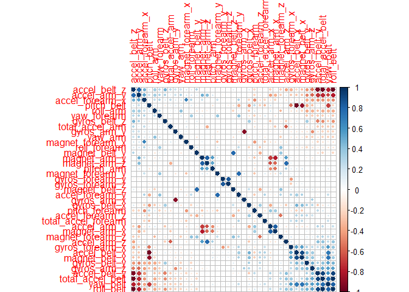

Peer graded Assignment Practicle Machine Learning
================
Mark Davey
May 17, 2017

Peer graded Assignment: Practicle Machine Learning
==================================================

Background
----------

Using devices such as *Jawbone Up, Nike FuelBand, and Fitbit* it is now possible to collect a large amount of data about personal activity relatively inexpensively. These type of devices are part of the quantified self movement - a group of enthusiasts who take measurements about themselves regularly to improve their health, to find patterns in their behavior, or because they are tech geeks. One thing that people regularly do is quantify how much of a particular activity they do, but they rarely quantify how well they do it. In this project, your goal will be to use data from accelerometers on the belt, forearm, arm, and dumbell of 6 participants. They were asked to perform barbell lifts correctly and incorrectly in 5 different ways. More information is available from [the website here](http://groupware.les.inf.puc-rio.br/har) (see the section on the Weight Lifting Exercise Dataset).

Data
----

The training data for this project are available [here](https://d396qusza40orc.cloudfront.net/predmachlearn/pml-training.csv).

The test data are available [here](https://d396qusza40orc.cloudfront.net/predmachlearn/pml-testing.csv)

The data for this project come from this [source](http://groupware.les.inf.puc-rio.br/har). If you use the document you create for this class for any purpose please cite them as they have been very generous in allowing their data to be used for this kind of assignment.

Prepare Environment
-------------------

Clean up old data, locate to working diretory, load the caret package and set the random seed so it is reproduceable.

``` r
rm(list=ls()) #Clean up work area
require("knitr") #We are knitting so lets get the package
opts_knit$set(root.dir = "~/GitHub/data")
library(caret) #load required packages
library(corrplot)
set.seed(3433) #set seed so it's reproducable
```

Download and load the data into R
---------------------------------

Retrieve the data from the internet if not already local and then load into Data Frames.

``` r
#setworking directory
setwd("~/GitHub/data")
#get the data from the remote system and unpack it only if does not exist
if (!file.exists("data")) {
  dir.create("data")
}
if (!file.exists("./data/pml-training.csv")) {
  fileURL <- "https://d396qusza40orc.cloudfront.net/predmachlearn/pml-training.csv"
  download.file(fileURL,destfile = "./data/pml-training.csv",method="libcurl")
}
if (!file.exists("./data/pml-testing.csv")) {
  fileURL <- "https://d396qusza40orc.cloudfront.net/predmachlearn/pml-testing.csv"
  download.file(fileURL,destfile = "./data/pml-testing.csv",method="libcurl")
}
#read 
pmltraining <- read.csv("./data/pml-training.csv")
pmltesting <- read.csv("./data/pml-testing.csv")
#summary(pmltraining) get an idea of the data
dim(pmltraining) #idea of data
```

    ## [1] 19622   160

Clean up the data
-----------------

This data was large in comparison with our previous examples. Many if the fields are factors or NA so remove all those which are not numeric. Leave "classe" since it is needed as the goal.

``` r
nums <- sapply(pmltraining, is.numeric) #find all the numeric columns
nums <- replace(nums,length(nums),TRUE) # keep the last column it contains the problem_id/classe
pmltraining <- pmltraining[,nums]
pmltesting <- pmltesting[,nums]
```

Remove data not related to the result since the problem specifies: *goal will be to use data from accelerometers on the belt, forearm, arm, and dumbell of 6 participants*

``` r
nums <- grepl("belt|arm|dumbell", names(pmltraining))
nums <- replace(nums,length(nums),TRUE) 
pmltraining <- pmltraining[,nums]
pmltesting <- pmltesting[,nums]
```

A lot of the data contains NA, since we hae so much data. Rather than fix it, it seemed better to remove it.

``` r
nums <- sapply(pmltraining, is.na) #find all the dirty column columns
nums = colSums(is.na(pmltraining)) == 0
pmltraining <- pmltraining[,nums]
pmltesting <- pmltesting[,nums]
```

Convert the goal to numeric to be used in GLM. It has to be numeric for poisson goal.

``` r
classNum = pmltraining$classe
levels(classNum) = 1:length(levels(pmltraining$classe))
```

Correlation of variable
-----------------------

Need to identify if the data is correlated so we may need to perform PCA.

``` r
M <- cor(pmltraining[,1:39])
corrplot(M, order ="FPC",  sig.level=0.4)
```



Cross Validation Data Split
---------------------------

Need to split the data for cross validation so we can identify which method has the best match

``` r
inTrain = createDataPartition(pmltraining$classe, p = 3/4)[[1]]
training = pmltraining[ inTrain,]
crossValidation = pmltraining[-inTrain,]
trainingCN = as.numeric(classNum[ inTrain])
testingCN= as.numeric(classNum[ -inTrain])
dim(training)
```

    ## [1] 14718    40

Train Multiple Models
---------------------

I tried multiple methods to find the best value. Train multiple models. Could combine if needed. Will use cross validation to select the best model.

### Logistic Regrestion

``` r
fit0 <- glm(trainingCN ~ ., family="poisson", data=training[,1:39])
```

### Random Forest

``` r
fit <- train(classe ~ .,
             data=training,
             method="rf",
             preProcess=c("center","scale"),
             ntree = 200) 
```

### Gradient Boosting Method

``` r
garbage <- capture.output(fit2 <- train(classe ~ .,
             data=training,method ="gbm",
               preProc = c("center","scale"),
               trControl = trainControl(preProcOptions = list(thresh = 0.8))))
```

### Naive Biase

``` r
fit3 <- train(classe ~ .,
             data=training,method ="nb",
               preProc = c("center","scale"),
               trControl = trainControl(preProcOptions = list(thresh = 0.8)))
```

### Neural network

``` r
#fit4 <- train(classe ~ .,data=training,method="nnet", preproc = c("center","scale"),maxit = 1000)
```

The neural net refused to converge so removed it.

I initially used PCA as a pre processor but it actually hurt the response. 95% vs 99% for Random forest. This corresponds to the corrplot which showed little correlation.

Perform machine learning
------------------------

Throw all the models now find which has the best accuracy.

``` r
cm1 <- confusionMatrix(crossValidation$classe,predict(fit,crossValidation))
cm1$overall[1]
```

    ##  Accuracy 
    ## 0.9914356

``` r
cm2 <- confusionMatrix(crossValidation$classe,predict(fit2,crossValidation))
cm2$overall[1]
```

    ##  Accuracy 
    ## 0.9378059

``` r
cm3 <- confusionMatrix(crossValidation$classe,predict(fit3,crossValidation))
cm3$overall[1]
```

    ##  Accuracy 
    ## 0.6612969

``` r
#cm4 <- confusionMatrix(crossValidation$classe,predict(fit4,crossValidation))
#cm4$overall[1]

cm1
```

    ## Confusion Matrix and Statistics
    ## 
    ##           Reference
    ## Prediction    A    B    C    D    E
    ##          A 1393    1    0    1    0
    ##          B    7  939    3    0    0
    ##          C    0    8  840    7    0
    ##          D    3    0    8  790    3
    ##          E    0    0    0    1  900
    ## 
    ## Overall Statistics
    ##                                           
    ##                Accuracy : 0.9914          
    ##                  95% CI : (0.9884, 0.9938)
    ##     No Information Rate : 0.2861          
    ##     P-Value [Acc > NIR] : < 2.2e-16       
    ##                                           
    ##                   Kappa : 0.9892          
    ##  Mcnemar's Test P-Value : NA              
    ## 
    ## Statistics by Class:
    ## 
    ##                      Class: A Class: B Class: C Class: D Class: E
    ## Sensitivity            0.9929   0.9905   0.9871   0.9887   0.9967
    ## Specificity            0.9994   0.9975   0.9963   0.9966   0.9998
    ## Pos Pred Value         0.9986   0.9895   0.9825   0.9826   0.9989
    ## Neg Pred Value         0.9972   0.9977   0.9973   0.9978   0.9993
    ## Prevalence             0.2861   0.1933   0.1735   0.1629   0.1841
    ## Detection Rate         0.2841   0.1915   0.1713   0.1611   0.1835
    ## Detection Prevalence   0.2845   0.1935   0.1743   0.1639   0.1837
    ## Balanced Accuracy      0.9962   0.9940   0.9917   0.9927   0.9982

The GLM results were unusable so I've not even tried to view. The Random Forest result has a very close match. GBM was a close second which is strange since it's a boosted random forest. Naive Baise performed badly. I was disappointed that no neural networks are included but I could net get it to work.

Get the result
--------------

    ##       problem_id answer1 answer2 answer3
    ##  [1,]          1       2       2       3
    ##  [2,]          2       1       1       1
    ##  [3,]          3       2       2       2
    ##  [4,]          4       1       1       1
    ##  [5,]          5       1       1       2
    ##  [6,]          6       5       5       5
    ##  [7,]          7       4       4       4
    ##  [8,]          8       2       2       2
    ##  [9,]          9       1       1       1
    ## [10,]         10       1       1       1
    ## [11,]         11       2       3       1
    ## [12,]         12       3       3       1
    ## [13,]         13       2       2       2
    ## [14,]         14       1       1       1
    ## [15,]         15       5       5       5
    ## [16,]         16       5       5       1
    ## [17,]         17       1       1       1
    ## [18,]         18       2       2       2
    ## [19,]         19       2       2       2
    ## [20,]         20       2       2       2

I submitted the data to the quiz and got 95% which matched by Cross Validation error which was in excees of 99%.

Executive Summary
-----------------

The data was very large and dirty requiring a lot of cleaning. Since there was so much data removing 75% of the column data was not an issue.

It was interesting how the data worked best on Random Forest vs all the other methods. Cross validation was critical to find the correct model to use. Given the large amount of data, I felt comfortable using 25% of the row data for non training purposes.
